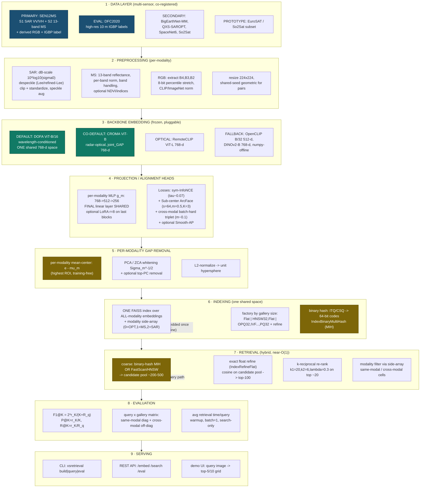

# BAH 2026 — Problem Statement 11
# Master Architecture: Cross-Modal Satellite Image Retrieval Using Multi-Sensor Remote Sensing Data

> **Status:** Definitive architecture (chief-architect deliverable). This document is the single source of truth that all implementation work must conform to. It synthesizes the six research reports under `research/` and the problem statement in `idea.md` into one rigorous, self-contained design.
>
> **Scope of this document:** the *what* and the *why* — data, backbones, alignment, retrieval, training, evaluation, code contract, complexity, risks, and references. No code is implemented here; the code package `xsretrieval` (Section 12) is documented to map 1:1 onto this design.
>
> **Citation convention:** each major decision is tagged with the backing research file, e.g. `[R1]` = `research/01_datasets.md`, `[R2]` = `research/02_foundation_models.md`, `[R3]` = `research/03_crossmodal_alignment.md`, `[R4]` = `research/04_fast_retrieval.md`, `[R5]` = `research/05_training_losses.md`, `[R6]` = `research/06_sota_evaluation.md`, `[PS]` = `idea.md`.

---

## Table of Contents

1. [Executive Summary](#1-executive-summary)
2. [Design Principles](#2-design-principles)
3. [System Architecture](#3-system-architecture)
4. [Data Layer](#4-data-layer)
5. [Embedding Backbones](#5-embedding-backbones)
6. [Cross-Modal Alignment](#6-cross-modal-alignment)
7. [Fast / O(1) Retrieval](#7-fast--o1-retrieval)
8. [Training Recipe](#8-training-recipe)
9. [Evaluation Methodology](#9-evaluation-methodology)
10. [Methods Catalogue (30+)](#10-methods-catalogue-30)
11. [Robustness & Cross-Verification](#11-robustness--cross-verification)
12. [Module / Code Architecture](#12-module--code-architecture)
13. [Latency Budget & Complexity](#13-latency-budget--complexity)
14. [Risks, Constraints & Fallbacks](#14-risks-constraints--fallbacks)
15. [References](#15-references)

---

## 1. Executive Summary

**The problem `[PS]`.** Satellite archives mix sensors — optical RGB, multispectral (MS, Sentinel-2 12–13 bands), and Synthetic Aperture Radar (SAR, Sentinel-1 VV/VH) — each capturing different physics of the same ground. We must build a content-based retrieval system that, given a query image from *any* modality, returns a ranked top-5 and top-10 of the most semantically relevant gallery images, where the gallery may contain the **same** modality (optical→optical, SAR→SAR, MS→MS) or **different** modalities (optical→SAR, SAR→optical, optical→MS, MS→optical). Relevance is judged by **semantic class / geographic correspondence / predefined relevance labels**.

**The scoring `[PS]` `[R6]`.** Five numbers decide the outcome:

| # | Metric | Family | Weight signal |
|---|--------|--------|---------------|
| 1 | **F1@5 (same-modal)** | accuracy | baseline |
| 2 | **F1@10 (same-modal)** | accuracy | baseline |
| 3 | **F1@5 (cross-modal)** | accuracy | **higher** ("more challenging") |
| 4 | **F1@10 (cross-modal)** | accuracy | **higher** |
| 5 | **Average retrieval time per query** | latency | lower is better |

The explicit instruction "*cross-modal retrieval may be given additional importance because it is more challenging*" `[PS]` means **the marginal engineering effort goes to cross-modal F1 and to keeping per-query latency low**, because same-modal optical retrieval is essentially a solved problem (deep hashing reaches >99% mAP on UC-Merced `[R6]`), while cross-modal F1 is bottlenecked by the *modality gap* `[R3]`.

**Solution thesis (one paragraph).** Map every modality into **one shared, L2-normalized embedding space** using a single wavelength-conditioned foundation backbone (**DOFA ViT-B**, with **CROMA ViT-B** as the radar-optical co-default and **RemoteCLIP ViT-L** as the optical specialist) `[R2]` `[R3]`; sharpen that space with tiny per-modality projection heads whose **final linear layer is shared**, trained with **symmetric InfoNCE + Sub-center ArcFace + cross-modal batch-hard triplet** on modality-balanced batches `[R3]` `[R5]`; **close the residual modality gap post-hoc with per-modality mean-centering plus PCA-whitening** (the single highest-ROI, training-free fix) `[R3]` `[R5]`; index the gallery in **one shared FAISS index over all-modality embeddings** with a modality side-array, served by a **hybrid near-O(1) pipeline** (binary-hash/HNSW coarse filter → exact float refine → cheap k-reciprocal re-rank) `[R4]`; and evaluate on the exact **F1@K = 2·r_K/(K + R_q)** matrix with disciplined batch-1 latency measurement `[R6]`. The whole accuracy-critical path runs on **frozen public weights with a tiny trainable head**, so it is CPU-deployable, fast, and ships with a **zero-training fallback** (frozen embeddings + mean-centering + whitening only) that already produces a competitive submission `[R3]` `[R5]`.

**Why this is the winning structure `[R6]`.** The SOTA landscape converges on exactly this shape: foundation-model embeddings beat task-specific CNNs by 20+ mR points; for cross-modal the winning recipe is a *shared multimodal backbone + per-modality whitening + a contrastive/ArcFace projection head + a single unified index + k-reciprocal re-rank*. The closest published analogue to PS-11, **CSMAE**, reports balanced **F1@10 ≈ 71%** on BigEarthNet-MM for both S1→S2 and S2→S1 `[R3]` — our target operating point for cross-modal, with same-modal expected substantially higher.

---

## 2. Design Principles

These are the non-negotiable invariants. Every module decision in this document is justified against them.

| # | Principle | What it means concretely | Backing |
|---|-----------|--------------------------|---------|
| **DP-1** | **One shared embedding space** | All modalities (OPT, MS, SAR) emit comparable, L2-normalized vectors in *one* space, so a single cosine/inner-product comparison serves same- and cross-modal alike. Achieved *architecturally* (one DOFA backbone) and *post-hoc* (mean-center + whiten). | `[R2]` `[R3]` `[R6]` |
| **DP-2** | **Modality-agnostic retrieval** | One FAISS index over all-modality embeddings + a `modality_id` side-array. Same/cross filtering is a post-filter on the side-array, never a separate index. A mixed-modality gallery is the native case. | `[R4]` `[R6]` |
| **DP-3** | **O(1) / sublinear latency** | Search must not be linear in gallery size `N` at scale. Hybrid pipeline: near-O(1) binary-hash (MIH) or O(log N) HNSW coarse filter → exact refine on a small pool → cheap k-reciprocal on top-20. Latency is "won or lost at the index layer." | `[R4]` |
| **DP-4** | **Train-light / zero-train fallback** | The accuracy-critical path is a *frozen* backbone + a few-million-parameter head (trains in hours on one GPU). A **zero-gradient** mode (frozen embeddings + mean-center + whiten) is always available and already strong. | `[R3]` `[R5]` |
| **DP-5** | **CPU-deployable** | Tuned CPU FAISS (Flat / HNSW / FastScan) meets the per-query latency target at PS-11 gallery scale; GPU is for *building* indexes and *batched* eval, never assumed for single-query latency. A pure-numpy offline backbone exists as the ultimate fallback. | `[R4]` `[R2]` |
| **DP-6** | **Multi-dataset & multi-backbone cross-verification** | No single dataset or backbone is trusted alone. We cross-fill datasets (SEN12MS core + DFC2020 eval + BigEarthNet-MM/QXS/SpaceNet6 for generalization) and cross-check backbones (DOFA vs CROMA vs RemoteCLIP; concat+whiten ensemble; rank fusion). Agreement is a relevance signal; disagreement flags hard queries. | `[R1]` `[R6]` |
| **DP-7** | **Reproducible, honest measurement** | Latency: warmup → batch=1 → search-only and end-to-end, median + p95, fixed threads, fixed hardware. F1: both raw and capped recall conventions, both relevance definitions, reported per matrix cell. | `[R4]` `[R6]` |
| **DP-8** | **Pluggability** | Backbones, indexes, losses, re-rankers are swappable behind stable interfaces (Section 12). Swap DOFA↔CROMA↔OpenCLIP with no pipeline change; swap Flat↔HNSW↔OPQ-IVF-PQ by a factory string. | `[R2]` `[R4]` |

**Corollary — where the cross-modal weight is spent `[R6]`.** ~60–70% of the cross-modal score comes from the alignment objective + modality-gap removal (DP-1); the shared backbone provides the aligned starting space; the unified index makes cross-modal serving native; k-reciprocal cleans noisy cross-modal rankings. Same-modal optical is near-saturated — do not over-invest there.

---

## 3. System Architecture

The pipeline is a linear flow with two timing regimes: the **gallery path** runs **once, offline** (embed every gallery image, fit whitening, build indexes); the **query path** runs **online** per query (embed → whiten → search → re-rank → return). Both share the same preprocessing → backbone → projection → whitening front end, which guarantees the query and gallery land in the identical space (DP-1).

### 3.1 ASCII end-to-end diagram

```
                          BAH 2026 PS-11  ·  xsretrieval  ·  end-to-end pipeline

 ┌──────────────────────────────────────── 1. DATA LAYER ────────────────────────────────────────┐
 │  PRIMARY  SEN12MS  : S1 SAR(VV,VH) + S2 MS(13b) + derived RGB(B4,B3,B2) + IGBP land-cover label │
 │  EVAL     DFC2020  : high-res 10 m IGBP labels (trustworthy query/gallery ground truth)         │
 │  2NDARY   BigEarthNet-MM (scale/multi-label) · QXS-SAROPT / SpaceNet6 (VHR SAR↔opt) · So2Sat    │
 │  PROTO    EuroSAT / So2Sat-subset (stand up the harness in hours)                               │
 └───────────────────────────────────────────────┬─────────────────────────────────────────────────┘
                                                  ▼
 ┌─────────────────────────────── 2. PREPROCESSING (per-modality) ───────────────────────────────┐
 │  SAR : dB = 10·log10(σ0) · despeckle (Lee/refined-Lee) · clip+standardize · speckle/VV-VH aug   │
 │  MS  : 13-band reflectance · per-band norm · band-dropout/spectral jitter · optional NDVI       │
 │  RGB : extract B4,B3,B2 · 8-bit percentile stretch · CLIP/ImageNet norm                         │
 │  ALL : resize 224×224 · SHARED-SEED geometric (flip/rot90/RRC) to preserve co-registration      │
 └───────────────────────────────────────────────┬─────────────────────────────────────────────────┘
                                                  ▼
 ┌────────────────────────── 3. BACKBONE EMBEDDING (frozen, pluggable) ──────────────────────────┐
 │  DEFAULT  DOFA ViT-B/16  → wavelength-conditioned, ONE shared 768-d space for S1+S2+RGB          │
 │  CO-DEF   CROMA  ViT-B   → radar-optical contrastive; joint_GAP / per-mod GAP 768-d             │
 │  OPTICAL  RemoteCLIP ViT-L 768-d (optical-to-optical specialist)                                │
 │  FALLBACK OpenCLIP B/32 512-d · DINOv2-B 768-d · pure-numpy offline backbone                    │
 │           output: pooled feature  f_m ∈ R^768  (GAP over patch tokens; > [CLS] for retrieval)   │
 └───────────────────────────────────────────────┬─────────────────────────────────────────────────┘
                                                  ▼
 ┌──────────────────────── 4. PROJECTION / ALIGNMENT HEADS (trainable, tiny) ────────────────────┐
 │  per-modality MLP  g_m : 768 → 512 → 256   with the FINAL linear layer SHARED across modalities  │
 │  per-modality BatchNorm · optional LoRA r=8 on last backbone blocks (merge at inference)         │
 │  trained with:  symmetric InfoNCE(τ≈0.07)  +  Sub-center ArcFace(s=64,m=0.5,K=3)                │
 │                 +  cross-modal batch-hard triplet(m≈0.1)  +  optional Smooth-AP(τ≈0.01)          │
 │           output: z_m ∈ R^256  (pre-whitening, pre-norm)                                         │
 └───────────────────────────────────────────────┬─────────────────────────────────────────────────┘
                                                  ▼
 ┌────────────────────── 5. PER-MODALITY WHITENING / MEAN-CENTERING (gap fix) ───────────────────┐
 │  (1) per-modality mean-center :  z' = z − μ_m          ← highest ROI, TRAINING-FREE             │
 │  (2) PCA / ZCA whitening      :  z'' = Σ_m^{−1/2} z'    (+ optional top-PC removal)             │
 │  (3) L2-normalize             :  e = z'' / ‖z''‖₂       → unit hypersphere, cosine = inner-prod │
 └───────────────────────────────────────────────┬─────────────────────────────────────────────────┘
                          gallery (offline)        │         query (online)
                ┌──────────────────────────────────┴───────────────────────────────────┐
                ▼                                                                        ▼
 ┌──────────── 6. INDEXING (built once) ───────────┐                  ┌──────── 7. RETRIEVAL (per query) ───────┐
 │  ONE shared FAISS index over ALL-modality e      │                  │  (a) coarse near-O(1) filter:           │
 │    + modality_id[] side-array (0=OPT,1=MS,2=SAR) │   query embedding │      binary-hash MIH  OR  HNSW/FastScan │
 │  factory by gallery size:                        │ ────────────────► │      → candidate pool ~200–500          │
 │    Flat | HNSW32,Flat | OPQ32,IVF…,PQ32 (+refine)│                  │  (b) exact float cosine refine → top-100│
 │  binary path: ITQ/CSQ → 64-bit → BinaryMultiHash │                  │  (c) k-reciprocal re-rank (k1=20,k2=6,  │
 │  optional PCA dim-reduction (PCAR128) for speed   │                  │      λ=0.3) on top ~20                   │
 └──────────────────────────────────────────────────┘                  │  (d) modality post-filter via side-array│
                                                                       │      → same-modal / cross-modal cell    │
                                                                       │  → return top-5 / top-10 ids            │
                                                                       └───────────────────┬─────────────────────┘
                                                                                           ▼
 ┌──────────────────────────────────── 8. EVALUATION ───────────────────────────────────────────┐
 │  F1@K = 2·r_K / (K + R_q)   ·   P@K = r_K/K   ·   R@K = r_K/R_q  (raw) or r_K/min(K,R_q) (capped)│
 │  query-modality × gallery-modality matrix → same-modal diagonal + cross-modal off-diagonal       │
 │  avg retrieval time/query: warmup → batch=1 → search-only (+ end-to-end) → mean + p50 + p95      │
 └───────────────────────────────────────────────┬─────────────────────────────────────────────────┘
                                                  ▼
 ┌──────────────────────────────────── 9. SERVING ─────────────────────────────────────────────┐
 │  CLI  `xsretrieval build|query|eval`  ·  REST API `/embed /search /eval`  ·  demo UI (top-K grid)│
 └──────────────────────────────────────────────────────────────────────────────────────────────┘
```

### 3.2 Mermaid flowchart

The same flow as a validated Mermaid flowchart (also saved standalone at `docs/diagrams/system_overview.mmd`):



---

## 4. Data Layer

The data strategy is **cross-fill** `[R1]`: take ONE dataset that gives co-registered SAR + MS + RGB + labels as the backbone (SEN12MS), use a trustworthy labelled subset as the held-out test (DFC2020), then borrow class-rich scale (BigEarthNet-MM), VHR SAR↔optical pairs (QXS-SAROPT / SpaceNet6), and clean single-label diversity (So2Sat) to verify generalization. The prototype ladder (EuroSAT → So2Sat subset → SEN12MS subset → full) lets us stand up the scoring harness in hours and grow without re-architecting `[R1]`.

### 4.1 Chosen datasets and roles

| Role | Dataset | Modalities | Why chosen | Backing |
|------|---------|-----------|------------|---------|
| **PRIMARY (train + tri-modal)** | **SEN12MS** | S1 SAR (VV/VH) + S2 MS (13b) + **derived RGB** (B4,B3,B2) + IGBP land-cover (17→10) | The *only* large global set delivering all three target modalities **co-registered at pixel level in one sample**, plus a class label. Covers every PS-11 direction. 180,662 triplets, 10 m, 256×256, all seasons/continents. First-class `torchgeo` support. | `[R1]` |
| **EVAL (held-out test)** | **IEEE GRSS DFC2020** | S1 + S2 + high-res LC | Curated SEN12MS-format subset with **high-resolution 10 m semi-manual labels** (vs 500 m MODIS noise in SEN12MS train) → trustworthy cross-modal F1 ground truth. Same 10-class IGBP. | `[R1]` `[R6]` |
| **SECONDARY (scale / multi-label)** | **BigEarthNet-MM (v1.0 / reBEN v2.0)** | S1 + S2 | ~550k pixel-aligned pairs with 19-class CLC2018 **multi-label**. Pretrain the shared SAR-MS encoder + test multi-label retrieval. The CSMAE F1@10≈71% benchmark is on this set. CDLA-Permissive. | `[R1]` `[R3]` `[R5]` |
| **SECONDARY (VHR SAR↔opt)** | **QXS-SAROPT**, **SpaceNet 6** | SAR + optical | High-resolution (1 m / 0.5 m) co-registered SAR↔optical → proves the retriever generalizes beyond Sentinel 10 m and to X-band SAR. Relevance = geographic pair identity (hardest case). | `[R1]` |
| **SECONDARY (clean single-label SAR↔MS)** | **So2Sat LCZ42** | S1 (8ch) + S2 (10ch) | ~400k co-registered patches, expert single-label (17 Local Climate Zones), high class purity → clean cross-modal F1 + fast prototyping. | `[R1]` |
| **PROTOTYPE (day-1 harness)** | **EuroSAT** (RGB + allBands), **So2Sat subset** | MS / SAR+MS | EuroSAT (27k, 10 cls, 64×64, ~90 MB RGB) validates the same-modal + FAISS + F1@K harness end-to-end in hours; So2Sat subset is the smallest co-registered SAR↔MS data to validate the cross-modal path. | `[R1]` |

> **Optional extensions** if scope allows `[R1]`: **3MOS** (cross-sensor SAR↔optical stress test, 6 SAR satellites); **Houston2018** (to demonstrate a hyperspectral modality); **RSICD/RSITMD/NWPU-Captions** as an optional text bridge (CLOSP-style anchor, Section 6).

### 4.2 Per-modality preprocessing

The **golden rule for paired training** `[R5]`: apply the *same* geometric transform (flip/rot90/RRC, shared random seed) to all co-registered modalities of a pair so pixel correspondence is preserved; apply photometric/radiometric augmentation *independently* per modality. All modalities resize to **224×224** (the input size for DOFA / CROMA / SoftCon / CLIP-family) `[R2]`.

**SAR (Sentinel-1 VV/VH)** `[R2]` `[R5]`:
- **dB scaling:** feed intensity as `dB = 10·log10(σ0)` (speckle becomes additive in log-domain — homomorphic). Typical clip ranges VV ∈ (−23, 0) dB, VH ∈ (−28, −5) dB, then standardize per channel.
- **Despeckle:** randomly apply Lee / refined-Lee / Gamma-MAP despeckling so the model sees speckled *and* smoothed versions → speckle-invariant features.
- **Speckle augmentation (training):** multiply by a Gamma(L, 1/L) speckle field with `L ∈ {1,2,4,8}` (multiplicative, Gamma-distributed, mean 1, variance 1/L) — the single most important SAR augmentation.
- **Polarization handling:** random VV/VH channel dropout (train on VV-only, VH-only, VV+VH) + optional VV/VH ratio as a derived channel + small per-channel gain jitter.
- **Backbone feed:** DOFA `wave_list=[5.405, 5.405]` (cm) for the 2-band tensor; CROMA `modality='SAR'`; for CLIP/DINOv2 fallbacks make a 3-channel `[VV, VH, VV/VH]`.

**Multispectral (Sentinel-2, 12–13 bands)** `[R2]` `[R5]`:
- Reflectance, per-band normalization (SSL4EO-S12 per-channel mean/std, clip mean±2σ → scale).
- **Band dropout / spectral tube-mask** (10–30% for contrastive) + **spectral jitter** (per-band gain/offset) + occasional band-subset/permutation → robust to differing band availability across gallery items.
- Optional **NDVI = (NIR−Red)/(NIR+Red)** (and NDWI) appended as channels to inject domain priors that align MS with optical semantics. Do **not** apply grayscale-style color suppression to MS (it destroys the spectral signal).
- **Backbone feed:** DOFA — pass per-band central wavelengths in µm (e.g. `[0.49,0.56,0.665,0.705,0.74,0.783,0.842,1.61,2.19]`); CROMA — drop B10 cirrus → 12-band, `modality='optical'`; CLIP/DINOv2 fallback — select RGB = B4,B3,B2.

**Optical RGB (derived from S2)** `[R1]` `[R2]`:
- Extract bands B4 (red), B3 (green), B2 (blue); 8-bit percentile stretch (e.g. 2–98%).
- Normalize with CLIP mean `[0.4815,0.4578,0.4082]`, std `[0.2686,0.2613,0.2758]` for CLIP-family, ImageNet stats for DINOv2, SSL4EO stats for DOFA.
- **Backbone feed:** DOFA `wave_list=[0.665,0.56,0.49]`; native 3-channel for CLIP/DINOv2.

**Augmentation summary `[R5]`:**

| Modality | Photometric/radiometric (independent) | Geometric (shared seed across paired modalities) |
|---|---|---|
| **SAR** | multiplicative Gamma speckle (L∈{1,2,4,8}), Lee/refined-Lee despeckle, dB input + dB jitter, VV/VH dropout + ratio | flips, rot90 (×4), RRC, ±10–15° rotation |
| **Optical RGB** | color jitter, random grayscale, blur, Cutout/Random-Erasing, RandAugment, haze/cloud sim | flips, rot90, RRC, ±10–15° rotation |
| **Multispectral** | band dropout / spectral tube-mask (10–30%), spectral jitter, band-order/subset randomization, NDVI/index aug | flips, rot90, RRC, ±10–15° rotation |
| **All (cross-modal)** | **modality dropout**, **cross-modal mixup** | identical seed per pair → preserve co-registration |

### 4.3 Query / gallery split and relevance-by-class

**Modality channels per SEN12MS sample** `[R1]`: `OPT_RGB` = S2 (B4,B3,B2, 8-bit stretch); `MS` = S2 all 13 (or 10 at 10 m); `SAR` = S1 (VV,VH, dB-scaled, despeckled); `label` = IGBP simplified class (DFC2020 high-res labels for eval).

**Splits (geographically disjoint to prevent leakage)** `[R1]` `[R6]`:
- **Train** = SEN12MS scenes (exclude any scene overlapping DFC2020 test ROIs); optionally + BigEarthNet-MM for pretraining.
- **Query/Gallery (eval)** = DFC2020 val/test (high-res labels). Per modality, a **query set** (≈20% of eval patches, stratified by class) and a **gallery** (remaining 80%). Build **same-modal galleries** (SAR-only, MS-only, RGB-only) and a **mixed cross-modal gallery** (all modalities pooled into one index).

**Relevance definition** `[R1]` `[R6]`: a retrieved gallery item is **relevant iff it shares the query's semantic class** (IGBP). For multi-label data (BigEarthNet) use ≥1 shared label or a Jaccard-overlap threshold τ (state τ explicitly), or graded relevance. For paired cross-modal, the co-located patch is an unambiguous ground-truth match. A query image is **never** in its own gallery.

**Gallery engineering (raises the F1 ceiling)** `[R6]`: build a **class-balanced gallery with ≈5–10 members per class** so that `R_q ≈ K` for K ∈ {5,10}. This is critical — Section 9 shows F1@K is *bounded by* `R_q`, so making `R_q ≈ K` is the difference between a perfect ranker scoring ~0.10 vs ~1.0.

---

## 5. Embedding Backbones

The backbone is the single biggest lever — backbone choice swings retrieval quality by 20+ mR points `[R6]`. We standardize on **768-d** as the primary index width (DOFA-B = CROMA-B = SoftCon-B = DINOv2-B = RemoteCLIP-ViT-L all emit 768) `[R2]`, with an **optional trainable projection to 256-d** (Section 6) for the cleanest shared space and fastest search. All backbones are **frozen**; only the projection head (and optional LoRA) trains. Pooling: **GAP over patch tokens** (CSMAE shows GAP > [CLS] for retrieval `[R3]`), then L2-normalize before FAISS.

### 5.1 Backbone roster

| Role | Model | HF id / source | Arch | Dim | Shared space? | License | Why | Backing |
|------|-------|----------------|------|-----|---------------|---------|-----|---------|
| **DEFAULT multimodal** | **DOFA** | `XShadow/DOFA` (mirror `earthflow/DOFA`) | ViT-B/16 + wavelength hypernet | **768** | **YES (one backbone)** | CC-BY-4.0 | S1, S2, RGB pass through the *same* weights via wavelength-conditioned patch embedding → CLS embeddings already in one 768-d space. Band-agnostic; generalizes to unseen sensors. **The best default for PS-11.** | `[R2]` `[R3]` |
| **CO-DEFAULT radar-optical** | **CROMA** | `antofuller/CROMA` | 2×ViT + fusion enc | **768** | **YES (`joint_GAP`)** | **MIT** | Purpose-built radar+optical contrastive MAE on SSL4EO-S12; emits `SAR_GAP`, `optical_GAP`, `joint_GAP`. Cross-modal often works *better out-of-the-box* than DOFA. Best fit if data is purely S1/S2. | `[R2]` `[R3]` `[R6]` |
| **OPTICAL specialist** | **RemoteCLIP** | `chendelong/RemoteCLIP` (`ViT-L-14`) | OpenCLIP ViT-L/14 | **768** | (text↔RGB) | research-permissive | SOTA RS image–image & image–text retrieval (+9 mR on RSITMD/RSICD). Best for optical→optical same-modal. Same 768-d → shares index width. | `[R2]` `[R6]` |
| **FALLBACK #1 (always works)** | **OpenCLIP ViT-B/32** | `laion/CLIP-ViT-B-32-laion2B-s34B-b79K` | ViT-B/32 | **512** | (generic) | **MIT** | Tiny, ubiquitous, offline-cacheable, interface-identical to RemoteCLIP/GeoRSCLIP → hot-swap weights. The safe universal fallback. | `[R2]` |
| **FALLBACK #2 (dense SSL)** | **DINOv2-B (+registers)** | `facebook/dinov2-with-registers-base` | ViT-B/14 | **768** | (generic) | Apache-2.0 | Best generic *frozen* features for image retrieval, no text head needed. Strong optical-to-optical + teacher. | `[R2]` |
| **FALLBACK #3 (offline)** | **pure-numpy backbone** | (in-repo) | hand-crafted descriptors | configurable | (generic) | n/a | If *no* weights can be downloaded (air-gapped CPU box): per-modality hand-crafted features (e.g. spectral/texture/Gabor/GLCM statistics + PCA) so the pipeline still produces vectors. Last-resort; weak but functional. | `[R2]` (fallback ethos) |

> **SAR/MS specialists available if needed `[R2]`:** **SoftCon** (`wangyi111/softcon`, ViT-B/14 768-d, best dedicated S1 *and* S2 frozen features, Apache-2.0) for same-modal SAR/MS; the SSL4EO-S12 zoo (DINO/MoCo/MAE S1/B13) as reliable per-modality baselines. These are per-modality (not a shared space by themselves) → pair with the projection head for cross-modal.
>
> **Explicitly NOT used `[R2]`:** **msGFM** weights are **NOT released** ("To be released" in the official repo) — conceptually ideal (RGB+MS+SAR+DSM in one space) but unusable today; do not plan around it. Heavier options (TerraMind, Galileo, AnySat, Clay) are strong but carry heavy dependencies (TerraTorch / bespoke I/O) — kept as optional, not default.

### 5.2 Standardization & dimensionality

- **Primary index width = 768.** Build the index on L2-normalized 768-d vectors `[R2]`.
- **Optional projection to 256-d** (Section 6): the trainable head reduces 768→256, which (a) unifies any mixed backbone widths into one space, (b) gives the cleanest single cross-modal space, and (c) is the fastest to search. 256-d is the retrieval sweet spot — enough capacity for 3 modalities + many classes, small enough for low latency `[R5]`.
- **512-d** only for large galleries with ample compute; **128-d** only when retrieval time is the binding constraint `[R5]`.
- **Mixed-width rule:** keep one FAISS index per embedding width, OR unify everything to 256-d via the projection head `[R2]`.

### 5.3 Two operating plans `[R2]`

- **Plan A (simplest, strong):** DOFA-B (768) frozen → mean-center + whiten → L2-norm → FlatIP. Same-modal & cross-modal from one index. This is also the **zero-training fallback** (Section 14).
- **Plan B (best accuracy):** DOFA-B *or* CROMA-B → trainable projection head (768→256, the Section 6 loss) → 256-d → mean-center + whiten → FlatIP/HNSW. Add RemoteCLIP-L for the optical-only sub-task and late-fuse scores. This is the **target submission**.

---

## 6. Cross-Modal Alignment

This is the highest-weighted part of the challenge `[R3]`. Two failure modes must both be solved `[R3]`: (1) **semantic misalignment** (embeddings encode sensor texture instead of land-cover) and (2) the **modality gap** (each modality occupies a narrow cone separated by a near-constant offset, so intra-modal distractors out-rank true cross-modal matches). The architecture attacks both: a shared backbone + shared-final-head + cross-modal losses fix semantics; per-modality mean-centering + whitening crush the residual gap.

### 6.1 Architecture: frozen backbone + per-modality heads with a shared final layer

```
            ┌─────────────────────────────────────────────────────────┐
 optical ─► │ FROZEN multimodal RS backbone (DOFA ViT-B preferred;     │ ─► f_opt ∈ R^768
   MS    ─► │   CROMA / RemoteCLIP / DINOv2 as alternates)            │ ─► f_ms  ∈ R^768
  SAR    ─► │   GAP over patch tokens                                  │ ─► f_sar ∈ R^768
            └─────────────────────────────────────────────────────────┘
                                   │
                                   ▼
        per-modality light projection head  g_m : 768 → 512 → 256   (2-layer MLP)
        with the FINAL linear layer SHARED across modalities  +  per-modality BatchNorm
        (optional LoRA r=8 on the backbone's last blocks, merged at inference)
                                   │  z_m ∈ R^256
                                   ▼
        per-modality mean-center (z − μ_m) → whiten (Σ_m^{−1/2}) → L2-norm
                                   │
                                   ▼
                         SHARED EMBEDDING SPACE  →  FAISS
```

- **Why a shared final head (late alignment) `[R3]`:** separate backbones/heads model speckle vs color natively, but forcing the *final* layer to be a single shared function `g(·)` makes the output geometry common — it *reduces* (not eliminates) the modality gap vs fully separate heads, and is cheap to bolt onto frozen backbones.
- **Why frozen backbone + tiny head (PEFT) `[R3]`:** best practicality/compute trade-off — leverages billions of pretraining samples, trains in hours on one GPU, tiny checkpoints, fast inference (one forward pass + FAISS). LoRA (`W_eff = W + (α/r)·BA`, r≪d) can be merged into `W` for zero inference overhead.
- **Optional CLOSP-style text/class anchor `[R3]` `[R5]` `[R6]`:** if SAR↔optical pairs are scarce, anchor each modality independently to a shared text/class-name space (no triple-aligned data needed). CLOSP shows semantic signatures learned from MS transfer to SAR via the text anchor (+18–20 nDCG on SAR retrieval). Kept as an optional bridge, not the default.
- **Closest published analogue `[R3]` `[R6]`:** **CSMAE** (cross-sensor MAE, purpose-built for sensor-agnostic CBIR) reports **F1@10 ≈ 71%** on BigEarthNet-MM for both S1→S2 and S2→S1; its best variant is **SECD + L_MIM**; without the inter-modal latent losses cross-modal drops to ~62–67%. This is our reference target and validates the "cross-reconstruction + explicit latent alignment" idea that our mean-centering/whitening approximates post-hoc.

### 6.2 Loss functions (exact math)

Train the heads (and optional LoRA) on modality-balanced batches of co-registered (or same-class) pairs. Let `z^a_i, z^b_i ∈ R^256` be the L2-normalized head outputs for the two modalities of pair `i`; temperature `τ` (learnable, init 0.07, clamp logit-scale ≤ ln 100 = 4.6); margin `m`.

**(1) Symmetric cross-modal InfoNCE (closes the modality gap) `[R3]` `[R5]`.** For a batch of N paired items with similarity matrix `S_ij = z^a_i · z^b_j`:

```
L_o→s = −(1/N) Σ_i log[ exp(S_ii/τ) / Σ_j exp(S_ij/τ) ]
L_s→o = −(1/N) Σ_i log[ exp(S_ii/τ) / Σ_j exp(S_ji/τ) ]
L_NCE = ½ (L_o→s + L_s→o)
```

The **symmetry** (A→B *and* B→A) is what forces a *shared* space rather than a one-directional projection `[R5]`. Summed over all modality pairs present in the batch, e.g. {OPT-SAR, OPT-MS, SAR-MS}. Cross-modal F1 is near-zero without this term `[R5]`.

**(2) Sub-center ArcFace (tight, noise-robust semantic clusters) `[R5]`.** L2-normalize feature `z` and class weights `W_{j,k}` (class j, sub-center k ∈ {1..K}); a sample only needs to be near its *nearest* sub-center:

```
cos θ̃_j = max_{k∈{1..K}} ( W_{j,k}ᵀ z )
L_arc = −log [ exp(s·cos(θ̃_y + m)) / ( exp(s·cos(θ̃_y + m)) + Σ_{j≠y} exp(s·cos θ̃_j) ) ]
```

with **s = 64, m = 0.5, K = 3 sub-centers**. The margin `m` is added to the *angle* (constant linear angular margin); the scale `s` re-inflates the bounded cosine so softmax can saturate. Sub-centers are robust to intra-class variation and label noise — essential for RS where "Forest" spans many seasons/sensors. The classifier head is **shared across all modalities** (one set of class prototypes fed by every encoder) → every modality of class c is pulled toward the same prototype = implicit cross-modal alignment. **Margin warmup**: ramp m from 0→0.5 over the first ~3 epochs to avoid early divergence; the classifier head LR must be *much* higher than the backbone LR `[R5]`.

**(3) Cross-modal batch-hard triplet (sharpen top-K rank order) `[R3]` `[R5]`.** Anchor `a ∈ modality X`, positive `p⁺ ∈ modality Y` same class/location, negative `n⁻` different class (any modality); `d = 1 − cosine`:

```
L_tri = (1/|T|) Σ_i [ m + d(z^a_i, z^{b+}_i) − d(z^a_i, z^{b-}_n) ]_+
```

with **margin m ≈ 0.1**, **semi-hard → batch-hard** curriculum (pure hardest-negative early causes collapse to degenerate minima; semi-hard is stable, then tighten). Within each P×K batch, for each anchor pick the hardest positive (farthest same-class) and hardest negative (closest different-class). This explicitly hardens the inter-modal class boundary that cross-modal F1 depends on.

**(4) Optional Smooth-AP (directly optimize the ranking F1@K rewards) `[R5]`.** Replace AP's non-differentiable indicator with a sigmoid `G(x;τ_s)=1/(1+e^{−x/τ_s})` over pairwise score differences `D_ij = s_i − s_j`:

```
AP_q ≈ smoothed rank ratios using G(D_ij; τ_s);   L_AP = (1/m) Σ_k (1 − AP_k)
```

with **τ_s ≈ 0.01**, **≥4 positives per query**, batch 256–384. Because F1@K is rank-based, Smooth-AP is the most metric-aligned loss; used as a **final-stage polish** on top of a good initialization, not from scratch (noisier gradients early).

**(5) Optional explicit gap-pull (CSMAE-style) `[R3]`:** `L_pull = (1/N) Σ_i ‖z^a_i − z^b_i‖²` pulls cross-modal pairs to coincide, shrinking the gap during training.

**Total objective (primary recipe, ranked #1) `[R5]`:**

```
L = 1.5 · L_NCE(cross-modal, learnable τ≈0.07)       # weighted ↑ : cross-modal scored higher
  + 1.0 · L_arc(Sub-center ArcFace, s=64,m=0.5,K=3)   # tight, noise-robust clusters + cross-modal pull via shared prototypes
  + 0.5 · L_tri(cross-modal batch-hard, m≈0.1)         # sharpen inter-modal boundary + top-K order
  ( + λ_AP · L_AP   in a final fine-tuning phase )      # direct rank optimization (optional)
  ( + λ_pull · L_pull,  λ_pull ≈ 0.1–0.5 )              # optional explicit gap-pull
```

The cross-modal InfoNCE weight is raised (λ_align = 1.5) precisely because cross-modal F1 is weighted higher in PS-11 `[R5]`. Normalize each loss to a similar scale before summing. Add an **intra-modal** triplet/InfoNCE term (same-modality positives by class) so same-modal F1 stays high `[R3]`.

### 6.3 Modality-gap remedies (post-hoc, ranked by ROI)

The modality gap is a *global minimum* of the contrastive loss at low temperature — it must be corrected, ideally post-hoc `[R3]`. Ranked remedies:

1. **Per-modality mean-centering (GR-CLIP) — highest ROI, training-free `[R3]` `[R5]`.** Compute each modality's mean embedding `μ_m` on a representative set and subtract before similarity: `e'_m = e_m − μ_m`, then L2-renormalize. This removes the constant offset between cones, directly lifting cross-modal cosine. GR-CLIP reports up to **+26 NDCG@10** over baseline CLIP with **75× less compute**. For a mixed-modality gallery, center each item by *its own* modality mean. **The single best gap remedy for PS-11.**
2. **PCA / ZCA whitening per modality (isotropy) `[R3]` `[R5]`.** `e'' = Σ_m^{−1/2}(e − μ_m)` makes each modality's cloud isotropic so cosine becomes a reliable semantic measure; optionally **remove the top principal component(s)** (the dominant direction often encodes sensor identity, not semantics). Fit on a balanced mix of all modalities (or per-modality then a common rotation). Regularize Σ with shrinkage on small data to avoid overfitting the whitening matrix. (Euclidean distance between whitened features = Mahalanobis between raw descriptors `[R5]`.)
3. **Temperature tuning + modality-balanced batches `[R3]` `[R5]`.** τ literally controls gap size; a moderately higher τ (or learnable τ with a ceiling, or warm→cool schedule) reduces the cone-separating repulsion. Modality-balanced batches (equal OPT/MS/SAR, many cross-modal positives) stop the loss from trivially separating by modality.

**Inference transform (applied identically to query and gallery) `[R3]`:** `e = normalize( Σ_m^{−1/2} ( g_m(f) − μ_m ) )`, optionally with top-1 PC dropped. The query is centered/whitened by *its own* modality's statistics.

---

## 7. Fast / O(1) Retrieval

A separate concern from the embedding model: given a query embedding, return top-k as fast as possible while keeping F1 high `[R4]`. The premise: because alignment puts every modality in **one space**, build **ONE shared FAISS index over all-modality gallery embeddings**, tag each vector with a modality id, and post-filter per evaluation case `[R4]`.

### 7.1 Two universal wins (applied throughout) `[R4]`

1. **L2-normalize everything → inner product = cosine.** With unit vectors `cosine(a,b) = a·b` and max-inner-product = min-L2. In FAISS: `faiss.normalize_L2(x)` on gallery AND queries, then `METRIC_INNER_PRODUCT`. Forgetting to normalize either side breaks the equivalence.
2. **PCA dim-reduction before indexing** (e.g. 768→128–256, even 64) via the `PCAR128` pre-transform (the `R` rotates/whitens, which also helps later PQ/OPQ). Cheaper distances + smaller index; validate that recall holds (over-aggressive PCA can hurt).

### 7.2 The hybrid "near-O(1) filter → exact refine → cheap re-rank" pipeline `[R4]`

This is the design that minimizes average query time the most:

1. **Coarse filter (near-O(1)-ish).** Learn **binary codes** (CSQ/DPSH if training a hashing head; else **ITQ** post-hoc on the float embeddings) and search with **`IndexBinaryMultiHash` (Multi-Index Hashing)** — hash-table lookup, effectively constant-time per query for short codes (provably sublinear for uniform codes; demonstrated on up to 1 billion codes). Fetch a candidate pool of **~200–500** by Hamming distance.
   - *All-float alternative:* substitute a **FastScan IVF** (`IVF…,PQ32x4fsr`) or **HNSW** first stage — both sublinear and extremely fast — for the same pool.
2. **Exact float refine (precision).** Recompute exact float cosine on just the candidate pool (`IndexRefineFlat` or a manual matmul), take top-100. Restores Flat-level F1 at trivial cost.
3. **k-reciprocal re-rank (F1 boost).** Apply k-reciprocal encoding on the **top ~20** only, with **k1 = 20, k2 = 6, λ = 0.3** `[R4]` `[R6]`. `d* = (1−λ)·d_Jaccard + λ·d_orig`. No training, no labels; lifts F1@5/@10, most valuable on the harder cross-modal queries. (Naïve full version is O(N²) — that's why it is capped to top-K.)
4. **(Optional)** geometric/RANSAC verification on the final top-10 for cross-modal *co-located* precision, if the budget remains.

This gives **hash-table/ANN speed for the 99% of work (pruning N → a few hundred)** and **exact-search accuracy for the 1% that determines F1** `[R4]`.

### 7.3 Index factory cheatsheet (per gallery size) `[R4]`

Embeddings L2-normalized, `METRIC_INNER_PRODUCT`, `d` after optional PCA, `N` = gallery size, `nlist ∈ [4√N, 16√N]`. **Always sweep `nprobe`/`efSearch` on a validation split until F1 plateaus, then back off to the latency budget.**

| Gallery `N` | Primary pick | `index_factory` string | Key runtime params | Notes |
|---|---|---|---|---|
| **~5k** | **Exact** | `"Flat"` (`IndexFlatIP`) | — | Sub-ms batched; F1 ceiling. **Don't over-engineer** — likely the right call for PS-11. |
| **~5k** (ultra-fast alt) | Binary hash + refine | ITQ-64 → `IndexBinaryMultiHash` → refine `Flat` | radius/`k`; rerank top-200 | Near-O(1) filter; refine restores F1. |
| **~50k** | **HNSW** | `"HNSW32,Flat"` | `efConstruction=80`, `efSearch=32–64` | O(log N), recall 0.97+, no training. |
| **~50k** (alt) | IVF exact | `"IVF2048,Flat"` | `nprobe=8–32` | √N≈224 → nlist 1024–4096; train ≥30k. |
| **~50k** (fastest CPU) | FastScan + refine | `"IVF2048,PQ32x4fsr,RFlat"` | `nprobe=16`, `k_factor=10` | Up to ~1M QPS class; near-Flat F1 after refine. |
| **~500k** | **IVF+OPQ-PQ (+refine)** | `"OPQ32_128,IVF16384,PQ32"` + `IndexRefineFlat` | `nprobe=16–64` | ~40 B/vec, compact + fast. |
| **~500k** (recall-max) | HNSW | `"HNSW32,Flat"` | `efSearch=64–128` | Highest recall; heavier RAM/build. |
| **~1M** | IVF-HNSW + OPQ-PQ (+refine) | `"OPQ32_128,IVF65536_HNSW32,PQ32"` | `nprobe=32–128`, refine top-100 | HNSW coarse quantizer removes large-nlist bottleneck. |
| **≥100M / disk** | DiskANN/Vamana | (diskannpy / Milvus) | search_L, beamwidth | Out of PS-11 scope (full-archive scale). |

> **One shared cross-modal index (recommended) `[R4]`:** build the chosen index over **all-modality** gallery embeddings; store a parallel `modality_id` array. For a query, retrieve top-(k+buffer), then **post-filter to the modality the evaluation case requires** (optical-only / SAR-only / keep all for cross-modal). Post-filtering a slightly larger candidate set keeps a single index in memory and is simplest. Tune `efSearch`/`nprobe` so ANN recall ≥ ~0.98 to avoid hurting F1.

### 7.4 Index family complexity reference `[R4]`

| Index | Query complexity | When |
|-------|------------------|------|
| `IndexFlatIP` (exact) | **O(N·d)** | small N (~1k–50k); F1 ceiling |
| `IVFx,Flat` (cell pruning) | ≈ **O(√N·d)** with nlist≈√N | great quality/speed/memory; the workhorse |
| `IVFPQ` + `OPQ` (compressed) | O(nlist·d) + M-lookup list scan | large N / tight memory (~32× smaller) |
| `PQ…x4fs` FastScan | 4–6× faster than ADC, SIMD in-register | **the CPU speed king**; FastScan + light refine often the best CPU operating point |
| `HNSW` (graph) | **O(log N·d)** | highest recall at medium N (memory-hungry) |
| `IVF…_HNSW` coarse | O(log nlist·d) + list scan | very large nlist (≥1M) |
| `IndexBinaryMultiHash` (MIH) | **near-O(1)** / provably sublinear | the closest to true O(1); hash-table lookup on binary codes |

### 7.5 Measuring "average retrieval time per query" correctly `[R4]` `[R6]`

The 5th scored metric is methodology-sensitive — measure honestly:

1. **Exclude index build/train/add from the timer.** Only time `search`. State build time separately.
2. **Warm up** ~1000 throwaway queries (page-in, JIT, caches), discard.
3. **Batch = 1** for the official "per query" number; loop one query at a time; report **mean + p50 + p95**. Any batched throughput number must be labelled as throughput, not latency.
4. **Pin threads** (`faiss.omp_set_num_threads(n)`); try `n=1` (removes thread-launch overhead for single-query) and `n=physical cores`; report which.
5. **Same machine** for all variants; record hardware, FAISS version, `d`, `N`, `nprobe`/`efSearch`, and the **F1/recall at that operating point** (latency without the accuracy it buys is meaningless).
6. **Include the full counted query path** — embedding the query (if counted) + ANN search + re-ranking — inside the measured window. Report (a) search-only and (b) end-to-end incl. encoder.

---

## 8. Training Recipe

The accuracy-critical path is the projection head (+ optional LoRA) on a frozen backbone, trained in two-to-three stages. Everything here is optional relative to the **zero-training fallback** (Section 8.4) — but it is the path to the top of the leaderboard `[R5]`.

### 8.1 Sampler: modality-balanced P×K `[R5]`

A **modality-balanced P×K sampler** is mandatory for the pair/triplet/SupCon/ArcFace/AP losses:
- **P = 16–32 classes**, **K = 4 per class**, with **K split across modalities** (e.g. 2 optical + 1 SAR + 1 MS of the same area/class) → batch 64–128 (scale with hardware).
- This single change guarantees every batch contains **same-class cross-modal positives** and **cross-modal hard negatives** → makes SupCon/triplet/MS *cross-modal-aware for free*.
- Optional **hard-class sampling**: group confusable land covers (e.g. different crop types) to mine harder negatives.
- For the ArcFace term, class-balanced (1 sample/class) suffices.

### 8.2 Per-modality augmentation policy `[R5]`

As in Section 4.2: SAR = multiplicative Gamma speckle (L∈{1,2,4,8}) + Lee/refined-Lee despeckle + dB scaling + dB jitter + VV/VH dropout + ratio channel; optical = color jitter/grayscale/blur/Cutout/RandAugment/haze-cloud sim; MS = band-dropout/spectral-tube-mask (10–30%) + spectral jitter + band-order randomization + NDVI/index aug; **all** = flips/rot90/RRC/±10–15° rotation with a **shared seed across the paired modalities** to preserve co-registration, plus **modality dropout** (randomly drop a modality so the model produces consistent embeddings from any subset → modality-agnostic, handles missing modality at query time) and **cross-modal mixup** (convex combinations across modalities to populate the inter-modal manifold).

### 8.3 Optimization & schedule `[R5]`

| Knob | Value |
|------|-------|
| Optimizer | **AdamW**, weight decay 0.05 (ViT) / 1e-4 (CNN) |
| **Differential LR** | backbone **1e-5–3e-5** (full finetune) or **1e-6** (strong backbone); head/classifier LR **1e-3 … 1.0** (ArcFace classifier likes a *much* higher LR — separate it; getting this wrong is "disastrous") |
| Schedule | **cosine annealing + linear warmup** (3–5 epochs / 5–10% of steps) |
| Temperature | learnable τ init 0.07, clamp logit-scale ≤ ln 100; or anneal τ 0.2→0.07 |
| Margin warmup | ArcFace m: 0→0.5 over first ~3 epochs |
| Batch | as large as memory allows (≥256 effective preferred for pair/AP losses); **MoCo cross-modal queue (16k–65k, momentum 0.999)** if GPU-limited, to supply InfoNCE negatives at small batch |
| Precision | mixed precision (AMP); **EMA of weights** for eval |
| Embedding | **256-d, L2-normalized** |

**Three-stage schedule `[R5]`:**
- **Stage A — alignment pretrain** (backbone frozen / LR 1e-5, train head + top blocks): symmetric InfoNCE (cross-modal) + SupCon, large effective batch (MoCo queue if needed), τ warm 0.2→0.07, head LR ~1e-3, ~10–15 epochs. Builds the shared space cheaply.
- **Stage B — full fine-tune with the primary trio:** unfreeze (or LoRA), margin warmup, add cross-modal batch-hard triplet, ~20–40 epochs, **early-stop on val cross-modal F1@10 (patience 3)**.
- **Stage C (optional polish):** add Smooth-AP (or FastAP) for ~5 epochs to directly optimize ranking.

### 8.4 Zero-training fallback (no gradient steps) `[R3]` `[R5]`

The safest day-1 baseline and the ablation floor:
1. Pick a frozen multimodal backbone (**DOFA** for OPT+MS+SAR in one model, or **CROMA** for SAR+optical). Embed every image (GAP over tokens).
2. On a small reference set, compute per-modality **mean μ_m** and **whitening Σ_m^{−1/2}** (shrinkage-regularized on small data); optionally remove the top PC.
3. At query/gallery time: `e = normalize( Σ_m^{−1/2}(raw − μ_m) )` → cosine / FAISS.

This needs **zero gradient steps** — just mean-centering + whitening (Section 6.3 remedies 1–2), which alone delivered up to +26 NDCG@10 for GR-CLIP `[R3]`. Same-modal will already be strong (foundation features are good intra-modal); centering+whitening is what makes cross-modal usable without training. **Optionally binary-hash** the embeddings (sign function, ~32× compression) for near-identical mAP at far faster search `[R5]`.

### 8.5 Post-processing & indexing (near-free F1) `[R5]`

PCA-whiten (fit on a modality-balanced sample) → optional dim-reduction to 256 → L2-normalize → store. FAISS `IndexFlatIP` for accuracy, or IVF-PQ / HNSW / FastScan for speed at large gallery; optional binary-hash for the latency metric. Query-time: L2-normalize the query embedding identically, apply the *same* whitening matrix.

---

## 9. Evaluation Methodology

Evaluation is matched exactly to the five scored metrics `[PS]` `[R6]`. The harness reports four headline F1 numbers (F1@5/@10 × {same-modal, cross-modal}) plus average retrieval time, and crucially handles the recall-denominator subtlety that *dominates* the achievable score.

### 9.1 Exact F1@K `[R6]`

For a single query `q` and cutoff `K ∈ {5,10}`:
- `retrieved_K` = top-K ranked gallery items by similarity.
- `rel(q)` = the relevant set for `q` in the gallery; `R_q = |rel(q)|`.
- `r_K = |retrieved_K ∩ rel(q)|` = number of relevant items among the top-K.

```
Precision@K  =  r_K / K
Recall@K     =  r_K / R_q                        (raw, convention A)
             =  r_K / min(K, R_q)                (capped, convention B)
F1@K         =  2·P@K·R@K / (P@K + R@K)
             =  2·r_K / (K + R_q)                (exact closed form, raw recall)
```

The closed form **F1@K = 2·r_K/(K + R_q)** is the cleanest way to compute it (substitute P and R). **Aggregation:** compute F1@K per query, average over all queries in a matrix cell ("macro over queries"), then average cells per the matrix in 9.3.

### 9.2 The R_q bound and the class-balanced remedy `[R6]`

`R@K = r_K/R_q` has a structural problem at fixed K:
- **Large class** (`R_q ≫ K`): even a perfect top-K gives `R@K = K/R_q` → recall capped low → F1 capped low. E.g. `R_q=100, K=5` → max `F1@5 = 2·5/(5+100) = 0.095` even with a *perfect* ranking. **The metric punishes large classes.**
- **Small class** (`R_q < K`): cannot fill K slots with relevants → precision drops. `R_q=2, K=5` perfect → `F1@5 = 2·2/(5+2) = 0.571`.

**Consequence:** F1@K is dominated by relevant-set sizes `R_q`, not only ranking quality.

**Two conventions (report both):** (A) **raw** `r_K/R_q` — the literal reading a grader most likely implements → **reported/primary**; (B) **capped** `r_K/min(K,R_q)` — removes the large-class cap so a perfect top-K → recall 1 → reflects ranking quality → **internal model selection**.

**Remedy (raises the ceiling) `[R6]`:** engineer a **class-balanced gallery with `R_q ≈ K`** (≈5–10 members per class). This makes A and B nearly coincide and maximizes achievable F1@5/@10. For paired cross-modal where `R_q=1`, additionally report Top-K accuracy / Recall@K alongside F1.

### 9.3 Evaluation matrix (query modality × gallery modality) `[R6]`

| Query ↓ \ Gallery → | OPT | MS | SAR |
|---|---|---|---|
| **OPT** | same-modal | cross-modal | cross-modal |
| **MS** | cross-modal | same-modal | cross-modal |
| **SAR** | cross-modal | cross-modal | same-modal |

- **Same-modal score** = average of diagonal cells (OPT→OPT, MS→MS, SAR→SAR).
- **Cross-modal score** = average of off-diagonal cells; PS-11 highlights **OPT↔SAR** and **OPT↔MS** specifically — ensure those four directional cells are present and weighted higher.
- **Mixed-gallery cell (recommended extra):** query = any modality, gallery = ALL modalities pooled (one unified index) — matches the stated outcome and is what a single FAISS index natively serves.

**Split rules `[R6]`:** disjoint query vs gallery per cell; a query is never in its own gallery; for paired data put one modality in the query set and others in the gallery so geographic ground truth is exploitable; class-balanced gallery; fixed, reported gallery size.

### 9.4 Latency metric `[R6]` `[R4]`

Average retrieval time per query = wall-clock per query for {embed query if counted} + {ANN search + re-rank}. Report **(a) search-only** and **(b) end-to-end incl. encoder**; specify hardware, batch=1, warm cache, whether the query embedding is precomputed; report **median + p95**, not just mean. (Full protocol in Section 7.5.)

### 9.5 Worked numeric example `[R6]`

**Same-modal optical→optical**, class "airport", gallery has `R_q = 8` other "airport" images. System returns top-10 with relevance pattern `[1,1,1,0,1,1,0,1,0,1]` (1 = relevant) → `r_5 = 4`, `r_10 = 7`.

| K | P@K | Raw R@K | **F1@K (raw)** | Capped R@K | F1@K (capped) |
|---|-----|---------|----------------|------------|----------------|
| 5 | 4/5 = 0.800 | 4/8 = 0.500 | **2·4/(5+8) = 0.615** | 4/min(5,8)=0.800 | 0.800 |
| 10 | 7/10 = 0.700 | 7/8 = 0.875 | **2·7/(10+8) = 0.778** | 7/min(10,8)=0.875 | 0.778 |

**Cross-modal optical→SAR**, `R_q = 1` (single co-located SAR tile is the only relevant), top-5 = `[0,1,0,0,0]` → `r_5 = 1`: `P@5 = 0.2`, raw `R@5 = 1.0` → **F1@5 = 2·1/(5+1) = 0.333** (capped identical). This shows why paired (`R_q` small) cross-modal *caps precision*: even a perfect rank-1 hit gives F1@5 = 0.333 → calibrate the gallery so `R_q ≈ K`, or report Recall@K / Top-K accuracy alongside F1 for paired retrieval.

---

## 10. Methods Catalogue (30+)

A consolidated table of **40 distinct methods/techniques** drawn from all six research reports, each with its role in our system. This explicitly demonstrates ≥30 cross-verified methods spanning datasets, backbones, alignment patterns, losses, retrieval/hashing/re-ranking, and evaluation tricks.

| # | Method / Technique | Category | Role in our system | Source |
|---|--------------------|----------|--------------------|--------|
| 1 | **SEN12MS** (S1+S2+RGB+IGBP, co-registered) | Dataset | PRIMARY training set; supplies all 3 modalities + labels in one sample | R1 |
| 2 | **DFC2020** (high-res IGBP labels) | Dataset | Held-out EVAL set; trustworthy cross-modal F1 ground truth | R1, R6 |
| 3 | **BigEarthNet-MM / reBEN** (S1+S2, 19-label) | Dataset | Pretrain shared SAR-MS encoder; multi-label retrieval; CSMAE benchmark | R1, R3, R5 |
| 4 | **QXS-SAROPT / SpaceNet 6** (VHR SAR↔opt) | Dataset | Cross-modal generalization to 1 m / X-band; pair-identity relevance | R1 |
| 5 | **So2Sat LCZ42** (clean single-label SAR↔MS) | Dataset | Clean cross-modal F1 + prototyping | R1 |
| 6 | **EuroSAT / prototype ladder** | Dataset | Day-1 harness validation (FAISS + F1@K) in hours | R1 |
| 7 | **DOFA** (wavelength-conditioned ViT-B) | Backbone | DEFAULT backbone; one shared 768-d space for S1+S2+RGB | R2, R3, R6 |
| 8 | **CROMA** (radar-optical contrastive MAE) | Backbone | CO-DEFAULT; `joint_GAP` cross-modal; best if data is pure S1/S2 | R2, R3, R6 |
| 9 | **RemoteCLIP** (OpenCLIP fine-tuned on RS) | Backbone | Optical-to-optical specialist; same 768-d index width | R2, R6 |
| 10 | **OpenCLIP ViT-B/32 (LAION-2B)** | Backbone | Always-works fallback; hot-swap weights | R2 |
| 11 | **DINOv2 (+registers)** | Backbone | Generic frozen-feature fallback + distillation teacher | R2 |
| 12 | **SoftCon** (S1 & S2 specialist) | Backbone | Optional same-modal SAR/MS specialist features | R2 |
| 13 | **GAP over patch tokens** (vs [CLS]) | Pooling | Standard pooling for all backbones (CSMAE: GAP > CLS for retrieval) | R3 |
| 14 | **Symmetric cross-modal InfoNCE** (CLIP-style) | Alignment loss | Core cross-modal aligner; closes the gap; weighted ↑ | R3, R5 |
| 15 | **Sub-center ArcFace** (s=64,m=0.5,K=3) | Alignment loss | Tight noise-robust clusters; shared prototypes = implicit cross-modal pull | R5 |
| 16 | **Cross-modal batch-hard triplet** (semi-hard→hard) | Alignment loss | Sharpen inter-modal boundary + top-K rank order | R3, R5 |
| 17 | **Smooth-AP** (τ≈0.01) | Ranking loss | Final-stage polish; directly optimizes the rank-based F1@K | R5 |
| 18 | **SupCon** (cross-modal positives) | Alignment loss | Stage-A alternative; class-cluster + cross-modal align | R5 |
| 19 | **Shared final projection head** (late alignment) | Architecture | Forces common output geometry; reduces gap | R3 |
| 20 | **LoRA / adapter PEFT** (r=8, merge at inference) | Architecture | Cheap capacity on frozen backbone; zero inference overhead | R3 |
| 21 | **CLOSP-style text/class anchor** | Alignment | Optional bridge when SAR↔optical pairs scarce; MS→SAR transfer | R3, R5, R6 |
| 22 | **CSMAE (cross-sensor MAE)** | Reference method | Closest published analogue; F1@10≈71% target on BigEarthNet-MM | R3, R6 |
| 23 | **DeCUR (common/unique decoupling)** | Alignment (alt) | Optional: retrieve on the explicitly-aligned common sub-embedding | R2, R3 |
| 24 | **Per-modality mean-centering (GR-CLIP)** | Gap remedy | **Highest-ROI training-free gap fix** (+26 NDCG@10) | R3, R5 |
| 25 | **PCA / ZCA whitening + top-PC removal** | Gap remedy | Isotropize each modality; remove sensor-identity direction | R3, R5 |
| 26 | **Temperature tuning + modality-balanced batches** | Gap remedy | τ controls gap size; balanced batches stop trivial separation | R3, R5 |
| 27 | **MoCo cross-modal queue** (16k–65k, m=0.999) | Training | Many negatives at small batch (limited GPU) | R5 |
| 28 | **Modality-balanced P×K sampler** | Sampling | Guarantees in-batch cross-modal positives + hard negatives | R5 |
| 29 | **SAR speckle/despeckle/dB augmentation** | Augmentation | Speckle-invariant SAR features; the key SAR aug | R5 |
| 30 | **MS band-dropout / spectral jitter** | Augmentation | Robust to differing band availability | R5 |
| 31 | **Modality dropout + cross-modal mixup** | Augmentation | Force reliance on the shared space; handle missing modality | R5 |
| 32 | **L2-norm → inner product = cosine** | Retrieval | Universal: cosine via `normalize_L2` + `METRIC_INNER_PRODUCT` | R4, R5 |
| 33 | **One shared FAISS index + modality side-array** | Retrieval | Modality-agnostic serving; post-filter per cell | R4, R6 |
| 34 | **FAISS `IndexFlatIP`** (exact) | Retrieval | Small-gallery F1 ceiling; default at PS-11 scale | R4 |
| 35 | **FAISS HNSW** (O(log N) graph) | Retrieval | High recall at medium N, no training | R4 |
| 36 | **FAISS IVF / OPQ-IVF-PQ / FastScan** | Retrieval | Sublinear + compact + CPU-fast for large galleries | R4 |
| 37 | **ITQ / CSQ / DPSH binary hashing** | Hashing | Compact binary codes for near-O(1) coarse filter | R4 |
| 38 | **Multi-Index Hashing (MIH)** | Hashing | The closest to true O(1); hash-table lookup on codes | R4 |
| 39 | **`IndexRefineFlat` exact refine** | Re-ranking | Restore Flat-level F1 after a compressed/ANN first stage | R4 |
| 40 | **k-reciprocal re-ranking** (k1=20,k2=6,λ=0.3) | Re-ranking | Unsupervised F1@5/@10 boost on top-K, esp. cross-modal | R4, R6 |
| 41 | **α-QE / DBA query expansion** | Re-ranking (opt) | Cheap recall gain; DBA is zero query-time cost | R4 |
| 42 | **PCA dim-reduction (`PCAR128`)** | Speed | Cheaper distances + smaller index before ANN | R4 |
| 43 | **F1@K = 2·r_K/(K+R_q) + raw/capped recall** | Evaluation | Exact scored metric + the R_q-bound remedy | R6 |
| 44 | **Class-balanced gallery (R_q≈K)** | Evaluation | Raises the achievable F1 ceiling | R6 |
| 45 | **Batch-1 latency protocol (warmup/p50/p95)** | Evaluation | Honest "avg retrieval time per query" | R4, R6 |
| 46 | **Multi-backbone ensemble (concat+whiten) + TTA** | Robustness | Cross-verify backbones; reduce variance (offline) | R6 |

> 46 rows > the 30-method requirement, each cross-referenced to its source report and mapped to a concrete role.

---

## 11. Robustness & Cross-Verification

Per DP-6 and Goal 4 of the brief `[R6]`, no single dataset/backbone is trusted alone.

- **Multi-dataset gap-filling `[R1]` `[R6]`.** Validate on BigEarthNet-MM (S1+S2, 19-label, clean geographic-pair cross-modal GT), SEN12MS / SEN1-2 (paired S1/S2), DFC2020 (high-res labels), and single-modal scene archives (PatternNet/AID/NWPU-RESISC45) for same-modal sanity. Cross-dataset evaluation guards against overfitting one archive's class distribution. The cross-fill cheat-sheet (Section 4.1) maps each capability gap to its best source.
- **Multi-backbone ensemble (concat + whiten) `[R6]`.** Concatenate embeddings from complementary backbones (e.g. CROMA + RemoteCLIP-image + DOFA), **whiten the concatenation, L2-norm** → a more robust descriptor that cross-verifies across backbones. Agreement between independently-trained embeddings is a strong relevance signal; disagreement flags hard/ambiguous queries. Alternatively **rank-fuse** their result lists (Reciprocal Rank Fusion). Mitigate the per-query cost by PCA-reducing the concatenation and/or precomputing gallery embeddings; **drop the ensemble at inference if the latency metric is tight** (keep it only for offline gallery quality).
- **Test-time augmentation (TTA) `[R6]`.** Multi-crop/flip; average descriptors (α-QE-style) for a small consistent F1 lift.
- **Agreement checks & metric cross-verification `[R6]`.** Compute F1@K with **both** recall conventions (raw + capped) and **both** relevance definitions (semantic-class + geographic-pair); confirm the *ranking of candidate systems* is stable across them before trusting a single number. Fill missing-modality gaps with the text/label anchor (CLOSP transfers MS→SAR semantics with zero SAR-optical pairs).

---

## 12. Module / Code Architecture

The implementation is the Python package **`xsretrieval`** in a **flat layout at the repo root** (consistent with the `.gitignore`, which ignores `data/`, `models/weights/`, `*.faiss`, `embeddings/`, runtime caches — and keeps source). The package maps 1:1 onto Sections 4–9. Interfaces below are the **contract** implementation must satisfy.

### 12.1 Repository directory tree (target)

```
bah2026-ps11/
├── ARCHITECTURE.md                 # this document (source of truth)
├── README.md                       # quickstart, install, CLI examples
├── pyproject.toml                  # package metadata, deps, console entry point `xsretrieval`
├── idea.md                         # problem statement
├── .gitignore
├── research/                       # the six research reports (R1–R6)
│   ├── 01_datasets.md … 06_sota_evaluation.md
├── docs/
│   └── diagrams/
│       └── system_overview.mmd     # the Mermaid flowchart (Section 3.2)
├── configs/                        # YAML run configs (dataset, backbone, loss, index)
│   ├── default.yaml
│   ├── zero_train.yaml             # frozen + mean-center + whiten (Section 8.4)
│   └── train_dofa.yaml             # Plan B training (Section 8.3)
├── data/                           # (gitignored except samples/) datasets + small samples
│   └── samples/                    # tiny committed sample for tests/demo
├── models/
│   └── weights/                    # (gitignored) downloaded backbone checkpoints
├── scripts/                        # thin entry scripts that call into xsretrieval
│   ├── download_data.py
│   ├── build_index.py
│   ├── run_eval.py
│   └── serve_api.py
├── tests/                          # unit/integration tests (pytest)
│   ├── test_preprocess.py
│   ├── test_backbones.py
│   ├── test_alignment.py
│   ├── test_index.py
│   ├── test_retrieval.py
│   └── test_eval.py
└── xsretrieval/                    # the package (flat layout)
    ├── __init__.py
    ├── config.py                   # dataclass configs, YAML load/validate
    ├── data/
    │   ├── __init__.py
    │   ├── datasets.py             # SEN12MS / DFC2020 / BigEarthNet-MM / EuroSAT loaders
    │   ├── preprocess.py           # per-modality normalization (SAR dB/despeckle, MS, RGB)
    │   ├── augment.py              # per-modality + shared-seed geometric aug, modality dropout/mixup
    │   └── splits.py               # query/gallery + relevance-by-class construction
    ├── models/
    │   ├── __init__.py
    │   ├── backbones.py            # Backbone registry: DOFA, CROMA, RemoteCLIP, OpenCLIP, DINOv2, numpy
    │   └── pooling.py              # GAP / CLS pooling
    ├── alignment/
    │   ├── __init__.py
    │   ├── heads.py                # per-modality projection MLP w/ shared final layer; optional LoRA
    │   ├── losses.py               # InfoNCE, SubCenterArcFace, cross-modal triplet, Smooth-AP, SupCon
    │   ├── sampler.py              # modality-balanced P×K sampler; MoCo queue
    │   └── whitening.py            # per-modality mean-center + PCA/ZCA whiten + top-PC removal
    ├── index/
    │   ├── __init__.py
    │   ├── faiss_index.py          # factory-string builder; one shared index + modality side-array
    │   └── hashing.py              # ITQ/CSQ codes + IndexBinaryMultiHash (MIH)
    ├── retrieval/
    │   ├── __init__.py
    │   ├── search.py               # hybrid: coarse filter → exact refine → modality post-filter
    │   └── rerank.py               # k-reciprocal (k1,k2,λ); optional α-QE/DBA
    ├── eval/
    │   ├── __init__.py
    │   ├── metrics.py              # F1@K (raw+capped), P@K, R@K; matrix aggregation
    │   └── timing.py               # warmup + batch-1 latency (mean/p50/p95)
    ├── pipeline.py                 # end-to-end orchestration (embed→whiten→index→search→eval)
    ├── serve.py                    # REST API (/embed /search /eval) + optional demo UI
    └── cli.py                      # `xsretrieval build|query|eval|serve`
```

### 12.2 Key interface contract (signatures)

```python
# ───────────────────────────── xsretrieval/config.py ─────────────────────────────
from dataclasses import dataclass
from typing import Literal, Sequence

Modality = Literal["opt", "ms", "sar"]            # 0=opt, 1=ms, 2=sar (the side-array codes)

@dataclass
class RunConfig:
    backbone: str = "dofa_vitb"                    # registry key (Section 5.1)
    embed_dim: int = 768                           # backbone output width
    proj_dim: int = 256                            # projection-head output (0 = no head / zero-train)
    whiten: bool = True                            # per-modality mean-center + whiten
    drop_top_pc: int = 1                           # remove top-N PCs (sensor identity)
    index_factory: str = "Flat"                    # FAISS factory string (Section 7.3)
    metric: str = "ip"                             # inner product (cosine after L2-norm)
    rerank_kreciprocal: bool = True
    k1: int = 20; k2: int = 6; lam: float = 0.3    # k-reciprocal params
    topk: Sequence[int] = (5, 10)                  # the scored cutoffs

    @classmethod
    def from_yaml(cls, path: str) -> "RunConfig": ...

# ──────────────────────────── xsretrieval/data/datasets.py ────────────────────────
import numpy as np
from typing import TypedDict, Iterator

class Sample(TypedDict):
    image: "np.ndarray"            # (C,H,W) raw raster for the given modality
    modality: Modality
    label: int                     # IGBP/LCZ class id  (-1 if unlabeled/pair-only)
    geo_id: str                    # shared location id → links co-registered modalities
    sample_id: str

class MultiSensorDataset:
    """Loads SEN12MS / DFC2020 / BigEarthNet-MM / EuroSAL; yields per-modality Samples."""
    def __init__(self, root: str, name: str, split: str): ...
    def __len__(self) -> int: ...
    def __getitem__(self, i: int) -> Sample: ...
    def iter_modality(self, modality: Modality) -> Iterator[Sample]: ...

# ─────────────────────────── xsretrieval/data/preprocess.py ───────────────────────
def preprocess_sar(img: "np.ndarray", *, db_scale=True, despeckle: str | None = "refined_lee",
                   clip_db=((-23, 0), (-28, -5))) -> "np.ndarray": ...
def preprocess_ms(img: "np.ndarray", *, bands: Sequence[int] | None = None,
                  add_ndvi: bool = False) -> "np.ndarray": ...
def preprocess_rgb(ms_img: "np.ndarray", *, rgb_bands=(3, 2, 1), stretch=(2, 98)) -> "np.ndarray": ...
def normalize(img: "np.ndarray", *, scheme: Literal["clip","imagenet","ssl4eo"]) -> "np.ndarray": ...

# ─────────────────────────── xsretrieval/models/backbones.py ──────────────────────
import torch

class Backbone(torch.nn.Module):
    """Frozen feature extractor. One instance handles all modalities it supports."""
    name: str
    embed_dim: int
    def embed(self, img: "torch.Tensor", modality: Modality) -> "torch.Tensor":
        """(B,C,H,W) → (B, embed_dim), GAP-pooled, NOT yet L2-normalized."""
        ...

def build_backbone(key: str, *, device: str = "cpu", weights: str | None = None) -> Backbone:
    """Registry: dofa_vitb | croma_vitb | remoteclip_vitl | openclip_b32 | dinov2_b | numpy_offline.
    Falls back to numpy_offline if weights cannot be downloaded (Section 14)."""
    ...

# ─────────────────────────── xsretrieval/alignment/heads.py ───────────────────────
class ProjectionHead(torch.nn.Module):
    """Per-modality 768→512→proj_dim MLP; the FINAL linear layer is SHARED across modalities."""
    def __init__(self, in_dim: int, proj_dim: int, modalities: Sequence[Modality],
                 lora_rank: int = 0): ...
    def forward(self, feat: "torch.Tensor", modality: Modality) -> "torch.Tensor":  # (B, proj_dim)
        ...

# ─────────────────────────── xsretrieval/alignment/losses.py ──────────────────────
def info_nce_symmetric(z_a, z_b, tau: float = 0.07) -> "torch.Tensor": ...
class SubCenterArcFace(torch.nn.Module):
    def __init__(self, dim: int, n_classes: int, s: float = 64., m: float = 0.5, k: int = 3): ...
    def forward(self, z, labels) -> "torch.Tensor": ...
def cross_modal_triplet(z_a, z_b, labels, margin: float = 0.1, mining: str = "batch_hard") -> "torch.Tensor": ...
def smooth_ap(scores, labels, tau: float = 0.01) -> "torch.Tensor": ...

# ─────────────────────────── xsretrieval/alignment/whitening.py ───────────────────
class PerModalityWhitener:
    """Fit per-modality mean μ_m and whitening Σ_m^{-1/2}; transform + L2-normalize."""
    def fit(self, embeddings: "np.ndarray", modality_ids: "np.ndarray", drop_top_pc: int = 1) -> "PerModalityWhitener": ...
    def transform(self, embeddings: "np.ndarray", modality_ids: "np.ndarray") -> "np.ndarray":  # centered+whitened+L2
        ...
    def save(self, path: str) -> None: ...
    @classmethod
    def load(cls, path: str) -> "PerModalityWhitener": ...

# ─────────────────────────── xsretrieval/index/faiss_index.py ─────────────────────
class SharedIndex:
    """ONE FAISS index over all-modality embeddings + a modality_id side-array (DP-2)."""
    def __init__(self, dim: int, factory: str = "Flat", metric: str = "ip"): ...
    def build(self, embeddings: "np.ndarray", modality_ids: "np.ndarray") -> None: ...   # L2-norm + train + add
    def search(self, queries: "np.ndarray", k: int,
               want_modality: Modality | None = None) -> tuple["np.ndarray", "np.ndarray"]:
        """Returns (distances, ids); over-fetches and post-filters by side-array when want_modality set."""
        ...
    def save(self, path: str) -> None: ...
    @classmethod
    def load(cls, path: str) -> "SharedIndex": ...

# ─────────────────────────── xsretrieval/index/hashing.py ─────────────────────────
class BinaryHashIndex:
    """ITQ/CSQ → packed codes → IndexBinaryMultiHash (MIH); near-O(1) coarse filter."""
    def fit(self, embeddings: "np.ndarray", nbits: int = 64, method: str = "itq") -> None: ...
    def build(self, embeddings: "np.ndarray") -> None: ...
    def search(self, queries: "np.ndarray", n_candidates: int = 256) -> "np.ndarray": ...   # candidate ids

# ─────────────────────────── xsretrieval/retrieval/search.py ──────────────────────
def hybrid_search(index: SharedIndex, hash_index: "BinaryHashIndex | None",
                  gallery: "np.ndarray", query: "np.ndarray", *, k: int,
                  n_candidates: int = 256, want_modality: Modality | None = None,
                  rerank: bool = True) -> "np.ndarray":
    """coarse filter → exact float refine → k-reciprocal re-rank → modality post-filter → top-k ids."""
    ...

# ─────────────────────────── xsretrieval/retrieval/rerank.py ──────────────────────
def k_reciprocal(query_emb, cand_embs, cand_ids, *, k1: int = 20, k2: int = 6, lam: float = 0.3) -> "np.ndarray": ...

# ─────────────────────────── xsretrieval/eval/metrics.py ──────────────────────────
def f1_at_k(retrieved_ids: Sequence[str], relevant_ids: set[str], k: int,
            capped: bool = False) -> float:
    """F1@K = 2·r_K/(K+R_q) raw, or with min(K,R_q) capped recall."""
    ...
def evaluate_matrix(results: dict, relevance: dict, ks: Sequence[int] = (5, 10)
                    ) -> dict:    # {"same_modal": {5:..,10:..}, "cross_modal": {...}, per-cell}
    ...

# ─────────────────────────── xsretrieval/eval/timing.py ───────────────────────────
def measure_latency(search_fn, queries: "np.ndarray", *, warmup: int = 1000,
                    threads: int = 1) -> dict:   # {"mean_ms":.., "p50_ms":.., "p95_ms":..}
    ...

# ─────────────────────────── xsretrieval/pipeline.py ──────────────────────────────
class RetrievalPipeline:
    """Glues backbone → head → whitener → index → search → eval per RunConfig."""
    def __init__(self, cfg: RunConfig): ...
    def embed_gallery(self, ds: MultiSensorDataset) -> tuple["np.ndarray", "np.ndarray"]: ...  # (emb, modality_ids)
    def fit_and_build(self, ds: MultiSensorDataset) -> None: ...     # whiten.fit + index.build (offline)
    def query(self, image, modality: Modality, k: int = 10,
              want_modality: Modality | None = None) -> list[str]: ...
    def evaluate(self, query_ds, gallery_ds) -> dict: ...

# ─────────────────────────── xsretrieval/cli.py ──────────────────────────────────
# Console entry point `xsretrieval` (declared in pyproject.toml):
#   xsretrieval build  --config configs/default.yaml --data <root>
#   xsretrieval query  --image <path> --modality sar --k 10 [--want-modality opt]
#   xsretrieval eval   --config configs/default.yaml --report out/metrics.json
#   xsretrieval serve  --host 0.0.0.0 --port 8000
def main(argv: Sequence[str] | None = None) -> int: ...
```

This contract makes the doc map 1:1 onto the code: each Section-4–9 concept has exactly one module and a stable signature, and the pluggability principle (DP-8) is realized through the backbone registry (`build_backbone`), the FAISS factory string (`SharedIndex.factory`), and the loss/re-rank functions.

---

## 13. Latency Budget & Complexity

Per DP-3, latency is governed by the index layer. Big-O per stage (`N` = gallery size, `d` = embedding dim, `K` = re-rank pool, `B` = backbone FLOPs/image):

| Stage | Per-query complexity | Notes |
|-------|----------------------|-------|
| Query preprocessing | O(C·H·W) | per-modality normalization; trivial |
| Backbone embed (query) | O(B) | one ViT-B forward; the dominant *end-to-end* cost; **0 for gallery at query time** (precomputed) |
| Whiten + L2-norm | O(d²) (or O(d) if diagonal) | one matrix-multiply (~µs) |
| **Coarse filter** | **near-O(1)** (MIH) / **O(log N·d)** (HNSW) / **O(√N·d)** (IVF) | the sublinear pruning step → candidate pool |
| Exact float refine | O(K·d) | K≈100–500 dot products (e.g. 100·256 ≈ 25.6k mults) |
| k-reciprocal re-rank | O(K²) on the pool (K≤20–50) | capped to top-K → cheap; never the full O(N²) |
| Modality post-filter | O(K) | scan side-array on the candidate pool |
| **Total search-only** | **≈ near-O(1) … O(log N·d) + O(K·d) + O(K²)** | dominated by the coarse filter |

**Targets `[R4]` `[R6]`:**
- **Small gallery (~5k):** `IndexFlatIP` is sub-millisecond batched → **search-only avg target < ~1 ms/query**; don't over-engineer.
- **Medium (~50k):** HNSW or FastScan+refine → **sub-ms to low-ms** search-only.
- **Large (~500k–1M):** OPQ-IVF-PQ / IVF-HNSW + refine → **low-ms** with recall ≥ 0.98.
- **End-to-end** (incl. query encoder, batch-1, CPU): backbone forward dominates → report separately; cache gallery embeddings so only the *query* pays the encoder cost.

Report mean + p50 + p95, search-only and end-to-end, with the F1/recall achieved at that operating point (latency without accuracy is meaningless) `[R4]`.

---

## 14. Risks, Constraints & Fallbacks

| Risk / Constraint | Mitigation / Fallback | Backing |
|-------------------|-----------------------|---------|
| **CPU-only environment** (no GPU at inference) | Tuned CPU FAISS (Flat / HNSW / FastScan) meets the latency target at PS-11 scale; GPU is only for building indexes / batched eval. Measure at batch=1 — GPU may be *no faster* single-query. | `[R4]` `[R2]` |
| **Backbone weights cannot be downloaded** (air-gapped / network failure) | Cascade: DOFA → CROMA → RemoteCLIP → OpenCLIP-B/32 (tiny, cache-friendly) → DINOv2-B → **pure-numpy offline backbone** (hand-crafted spectral/texture descriptors). The pipeline always produces vectors. `build_backbone` auto-falls-back. | `[R2]` |
| **No time / compute to train** | **Zero-training mode** (Section 8.4): frozen embeddings + per-modality mean-centering + whitening only. Already strong (+26 NDCG@10 from centering alone for GR-CLIP); the safe day-1 submission and ablation floor. | `[R3]` `[R5]` |
| **Modality gap tanks cross-modal F1** | Per-modality mean-centering (highest ROI) + PCA-whitening + top-PC removal + temperature/modality-balanced batches; shared backbone + shared final head as architectural prevention; optional CSMAE-style `L_pull`. | `[R3]` |
| **F1@K artificially floored by R_q** (large/small classes) | Class-balanced gallery with `R_q ≈ K`; report both raw and capped recall; for paired cross-modal (`R_q=1`) also report Recall@K / Top-K accuracy. | `[R6]` |
| **Small gallery (exact) vs large gallery (ANN) mismatch** | Index factory selects by gallery size (Section 7.3): Flat for ~5k (exact, best F1), HNSW/FastScan for ~50k, OPQ-IVF-PQ/IVF-HNSW for ~500k–1M; always pair ANN with an exact refine pass and validate recall ≥ 0.98. | `[R4]` |
| **msGFM dependency** (ideal multimodal model) | **Not released** — explicitly excluded; never planned around. Use DOFA/CROMA instead. | `[R2]` |
| **SEN12MS labels coarse** (500 m MODIS on train) | Use DFC2020 high-res labels for the official query/gallery eval; optionally clean train labels via published high-res reference maps. | `[R1]` |
| **Multi-label ambiguity** (BigEarthNet "same class" undefined) | Relevance via ≥1 shared label or Jaccard ≥ τ (state τ); multi-label SupCon (positive weight ∝ label overlap); or single dominant class. | `[R5]` `[R6]` |
| **Heavy-dependency backbones** (TerraMind/TerraTorch, Galileo, AnySat) | Strong but heavy I/O — kept optional, never default; DOFA/CROMA have light interfaces. | `[R2]` |
| **Grader's exact F1 formula unknown** | Assume raw recall (convention A) for the leaderboard, select internally on capped (B); engineer `R_q ≈ K` so both coincide. | `[R6]` |
| **Latency metric methodology dispute** | Strict protocol (Section 7.5): exclude build, warmup, batch=1, fixed threads/hardware, report search-only + end-to-end + p50/p95. | `[R4]` `[R6]` |

---

## 15. References

Consolidated from the six research reports. Grouped by theme; each entry traces to where it is used in this architecture.

**Datasets `[R1]`**
- SEN12MS — arXiv:1906.07789; ISPRS Annals IV-2-W7; github.com/schmitt-muc/SEN12MS; torchgeo `SEN12MS`.
- BigEarthNet-MM — arXiv:2105.07921; bigearth.net; reBEN/v2 Zenodo 10891137; torchgeo `BigEarthNet`.
- So2Sat LCZ42 — arXiv:1912.12171; TFDS `so2sat`; torchgeo `So2Sat`.
- DFC2020 / SEN12MS classification — grss-ieee.org IADF; ieee-dataport; arXiv:2104.00704.
- QXS-SAROPT — arXiv:2103.08259; github.com/yaoxu008/QXS-SAROPT. SpaceNet 6 — spacenet.ai/sn6-challenge. SEN1-2 — arXiv:1807.01569.
- EuroSAT — madm.dfki.de; torchgeo `EuroSAT`. PatternNet — arXiv:1706.03424. 3MOS — arXiv:2404.00838. SSL4EO-S12 — arXiv:2211.07044 / 2503.00168. MMEarth — arXiv:2405.02771.

**Foundation backbones `[R2]`**
- DOFA — Xiong et al., arXiv:2403.15356; HF `XShadow/DOFA` (mirror `earthflow/DOFA`); github.com/zhu-xlab/DOFA; DOFA-CLIP arXiv:2503.06312.
- CROMA — Fuller et al., NeurIPS 2023, arXiv:2311.00566; HF `antofuller/CROMA`; github.com/antofuller/CROMA.
- RemoteCLIP — arXiv:2306.11029; HF `chendelong/RemoteCLIP`. GeoRSCLIP/RS5M — arXiv:2306.11300; HF `Zilun/GeoRSCLIP`. SkyCLIP — arXiv:2312.12856.
- SoftCon — arXiv:2405.20462; HF `wangyi111/softcon`. DeCUR — ECCV 2024, arXiv:2309.05300; HF `wangyi111/DeCUR`.
- OpenCLIP — github.com/mlfoundations/open_clip; HF `laion/CLIP-ViT-B-32-laion2B-s34B-b79K`. DINOv2 — HF `facebook/dinov2-with-registers-base`.
- msGFM — github.com/boranhan/Geospatial_Foundation_Models; arXiv:2404.01260 — **weights not released**.

**Cross-modal alignment `[R3]`**
- CLIP — Radford et al. 2021, arXiv:2103.00020. CSMAE — arXiv:2401.07782, IEEE TGRS, github.com/jakhac/CSMAE (closest analogue, F1@10≈71%).
- Modality gap — Liang et al. "Mind the Gap", NeurIPS 2022, arXiv:2203.02053; GR-CLIP / mean-centering arXiv:2507.19054; Contrastive Gap arXiv:2405.18570; Decipher the Gap arXiv:2510.03268.
- DeCUR arXiv:2309.05300; SwAV (prototype alignment) arXiv:2006.09882; LoRA arXiv (Hu et al., ICLR 2022); Adapter (Houlsby et al., ICML 2019); RS PEFT arXiv:2504.17397.
- Knowledge distillation in RS — arXiv:2409.12111; ERVD arXiv:2412.18136. Deep CCA — Andrew et al., ICML 2013. Optimal transport DA — Courty et al., TPAMI 2017.

**Training losses / sampling / augmentation `[R5]`**
- InfoNCE/NT-Xent temperature — "Understanding the Behaviour of Contrastive Loss", CVPR'21, arXiv:2012.09740. CLOSP — arXiv:2507.10403. SARCLIP — arXiv:2510.22665. Mind the Modality Gap — arXiv:2402.09816.
- SupCon — Khosla et al., arXiv:2004.11362. Triplet/mining — FaceNet, CVPR 2015; "Sampling Matters", arXiv:1706.07567. ArcFace — arXiv:1801.07698; AdaCos — arXiv:1905.00292.
- Proxy-Anchor — arXiv:2003.13911. Multi-Similarity — arXiv:1904.06627. Circle loss — arXiv:2002.10857. Smooth-AP — arXiv:2007.12163; FastAP — CVPR'19. NormSoftmax — arXiv:1811.12649. MoCo — He et al.
- PyTorch-Metric-Learning (default hyperparameters). PCA-whitening / L2-norm — arXiv:1907.11854; arXiv:1711.02512. SAR speckle/dB — MDPI RS 11/13/1532; arXiv:2307.06855. IBM/Prithvi RS retrieval (zero-training, binary codes) — arXiv:2403.02059; github.com/IBM/remote-sensing-image-retrieval.

**Fast retrieval / hashing / re-ranking `[R4]`**
- FAISS — Guidelines to choose an index; Faiss indexes; Binary indexes; FastScan; MetricType and distances; Threads; How to make Faiss faster (github.com/facebookresearch/faiss/wiki/*); FAISS paper arXiv:2401.08281.
- ScaNN — Guo et al., MLR v119 (anisotropic VQ); arXiv:1908.10396. Multi-Index Hashing — Norouzi et al., PAMI 2014; github.com/norouzi/mih. Inverted Multi-Index — Babenko & Lempitsky, CVPR 2012.
- ITQ — Gong & Lazebnik. DPSH — arXiv:1511.03855. CSQ — arXiv:1908.00347; github.com/swuxyj/DeepHash-pytorch. DiskANN/Vamana — NeurIPS'19.
- k-reciprocal re-ranking — Zhong et al., CVPR'17, arXiv:1701.08398. α-QE / DBA — arXiv:1811.00202. Dimensionality reduction for retrieval — ScienceDirect S2666912922000241.

**SOTA landscape / evaluation `[R6]`**
- CLOSP — arXiv:2507.10403. CROMA — arXiv:2311.00566. CSMAE — arXiv:2401.07782. DUCH — arXiv:2201.08125. PromptMID — arXiv:2502.18104.
- RSITR leaderboard (iEBAKER table) — arXiv:2504.05644; RemoteCLIP arXiv:2306.11029; GeoRSCLIP arXiv:2306.11300; PIR arXiv:2405.10160.
- Same-modal deep hashing mAP (DHPL/HPSH) — MDPI RS 13/15/2924, 12/17/2789; MHCLN arXiv:1904.01258. F1-score — en.wikipedia.org/wiki/F-score. Modality gap (AlignCLIP) — arXiv:2406.17639. ArcFace — arXiv:1801.07698. k-reciprocal — arXiv:1701.08398.

---

*End of master architecture. The companion Mermaid flowchart is at `docs/diagrams/system_overview.mmd`. Implementation must conform to the interface contract in Section 12 and the design principles in Section 2.*
